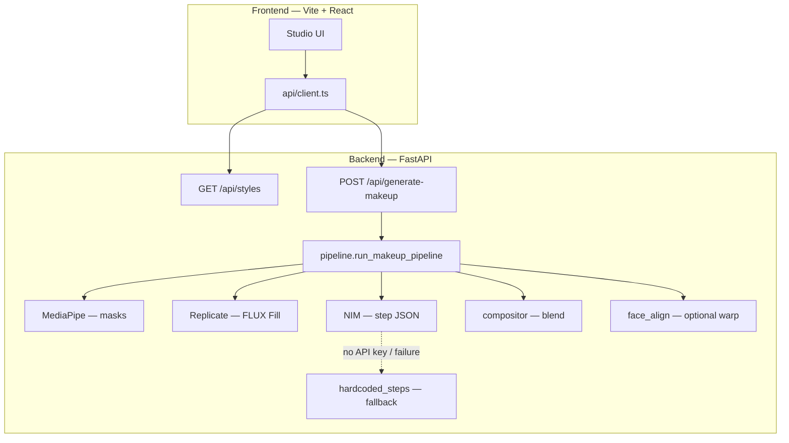

# Glam AI

**Glam AI** is a full-stack demo that turns a face-forward selfie into a **styled makeup look** plus a **step-by-step “masked reveal” tutorial**. One **FLUX Fill** inpaint produces the target look; an **LLM** (NVIDIA NIM) proposes ordered steps; **MediaPipe Face Mesh** splits the face into regions; **OpenCV** composites FLUX output onto the original photo per region so pose, hair, and background stay yours.

Repository: [github.com/DeoUtkarsh/Glam_AI](https://github.com/DeoUtkarsh/Glam_AI)

---

## Architecture

### High-level flow



### Phase 1 vs phase 2 (product logic)

| Phase | What the user sees | How it is produced |
|-------|--------------------|--------------------|
| **Final look** | One hero image | Last frame after applying **all** tutorial steps via masked compositing (not raw FLUX alone), so identity and geometry track the original photo. |
| **Tutorial steps** | Ordered cards with thumbnails | Same composited pipeline: start from the **original** image and blend in the **FLUX** result only inside the **region mask** for each step (skin, brows, eyes, lips). |

### Backend services (mental map)

| Module | Responsibility |
|--------|----------------|
| `app/main.py` | FastAPI app, CORS, router wiring. |
| `app/config.py` | Pydantic settings: NIM, Replicate, FLUX params, `FLUX_FACE_ALIGN`, `CORS_ORIGINS`. |
| `app/routers/makeup.py` | Validates upload (JPEG/PNG/WebP, size cap), calls pipeline. |
| `app/routers/styles.py` | Lists built-in makeup styles. |
| `app/services/pipeline.py` | Orchestrates decode → masks → parallel FLUX + steps → optional align → tone match → compositing → PNG base64 response. |
| `app/services/face_mesh_masks.py` | Face oval inpaint mask + soft region masks (`skin`, `brows`, `eyes`, `lips`). Eye mask excludes iris/sclera to reduce closed/double-eye artifacts. |
| `app/services/flux_replicate.py` | `black-forest-labs/flux-fill-dev` on Replicate (image + mask + prompt). |
| `app/services/grok_steps.py` | NIM OpenAI-compatible chat → JSON step list; falls back to `hardcoded_steps` if no key or parse failure. |
| `app/services/hardcoded_steps.py` | Per-style ordered `{name, region}` steps when LLM is unavailable. |
| `app/services/compositor.py` | Per-region alpha caps, LAB tone match toward original skin, `composite_masked_reveal_steps`. |
| `app/services/face_align.py` | Optional affine alignment of FLUX output to original (off by default). |
| `app/services/prompts.py` | FLUX prompt from selected style (identity / eyes-open constraints). |
| `app/services/styles.py` | Canonical style catalog (`bridal`, `glam`, `natural`, …). |

### Request / response shape

- **POST `/api/generate-makeup`** — `multipart/form-data`: `image` (file), `style_id` (string).
- **Response** — `GenerateMakeupResponse`: `style_id`, `style_name`, `final_image` (base64 PNG), `steps[]` with `step_num`, `name`, `region`, `image` (base64 PNG after that step).

### Frontend

- **Vite + React + TypeScript + Tailwind**; fetches styles and posts the selfie to the API.
- **`VITE_API_URL`** — API origin in dev (defaults to `http://127.0.0.1:8001` when unset).

---

## Prerequisites

- **Python 3.11+** (recommended) and **Node.js 20+**
- **Replicate** account and API token (FLUX Fill)
- **NVIDIA NIM** API key (optional — without it, step order uses built-in lists)

---

## Local development

### 1. Backend

```bash
cd backend
python -m venv .venv
# Windows: .venv\Scripts\activate
# macOS/Linux: source .venv/bin/activate
pip install -r requirements.txt
cp .env.example .env
# Edit .env: REPLICATE_API_TOKEN, NIM_API_KEY (optional), CORS_ORIGINS if needed
python -m uvicorn app.main:app --reload --host 127.0.0.1 --port 8001
```

- Health: `GET http://127.0.0.1:8001/health`
- Styles: `GET http://127.0.0.1:8001/api/styles`

### 2. Frontend

```bash
cd frontend
npm install
cp .env.example .env
# Optional: set VITE_API_URL if the API is not on 127.0.0.1:8001
npm run dev -- --port 5174
```

Open the URL Vite prints (e.g. `http://localhost:5174`).

### Environment variables (summary)

| Variable | Where | Purpose |
|----------|--------|---------|
| `REPLICATE_API_TOKEN` | `backend/.env` | FLUX Fill on Replicate |
| `NIM_API_KEY` | `backend/.env` | Optional LLM for custom step ordering |
| `NIM_MODEL` | `backend/.env` | e.g. `meta/llama-3.3-70b-instruct` |
| `FLUX_NUM_INFERENCE_STEPS`, `FLUX_GUIDANCE` | `backend/.env` | Inpaint strength vs fidelity |
| `FLUX_FACE_ALIGN` | `backend/.env` | `true`/`false` — affine warp (default off) |
| `CORS_ORIGINS` | `backend/.env` | Comma-separated browser origins |
| `VITE_API_URL` | `frontend/.env` | API base URL in dev |

Restart Uvicorn after changing backend `.env` (settings are cached).

---

## Repository layout

```
Glam-AI-Utkarsh/
├── README.md
├── backend/
│   ├── app/
│   │   ├── main.py
│   │   ├── config.py
│   │   ├── schemas.py
│   │   ├── routers/
│   │   └── services/
│   ├── requirements.txt
│   └── .env.example
└── frontend/
    ├── src/
    ├── package.json
    └── .env.example
```

---

## Security

- **Never commit** `backend/.env` or real API keys. Use `.env.example` only as a template.
- If keys were ever shared, rotate them at [Replicate](https://replicate.com/account/api-tokens) and [NVIDIA Build](https://build.nvidia.com).

---

## License

Specify your license here (e.g. MIT) when you choose one.
